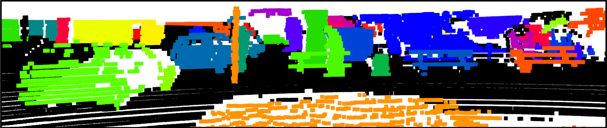

# (3DUIS) 3D Unsupervised Instance Segmentation

**[Paper](https://www.ipb.uni-bonn.de/pdfs/nunes2022ral-iros.pdf)**



# Installation

Installing pre-requisites:

`sudo apt install build-essential python3-dev libopenblas-dev`

`pip3 install -r requirements.txt`

Next install MinkowskiEngine:

`pip3 install -U git+https://github.com/NVIDIA/MinkowskiEngine --install-option="--blas=openblas" -v --no-deps`

# Data Preparation

Download [SemanticKITTI](http://www.semantic-kitti.org/dataset.html#download) inside the directory ```./Datasets/SemanticKITTI/datasets```. The directory structure should be:

```
./
└── Datasets/
    └── SemanticKITTI
        └── dataset
          └── sequences
            ├── 00/           
            │   ├── velodyne/	
            |   |	├── 000000.bin
            |   |	├── 000001.bin
            |   |	└── ...
            │   └── labels/ 
            |       ├── 000000.label
            |       ├── 000001.label
            |       └── ...
            ├── 08/ # for validation
            ├── 11/ # 11-21 for testing
            └── 21/
                └── ...
```

For the unsupervised ground segmentation you need to run [patchwork](https://github.com/LimHyungTae/patchwork) over the SemanticKITTI dataset and put the generated files over:
```
./
└── Datasets/
    └── SemanticKITTI
        └── assets
            └── patchwork   
                ├── 08
                    ├── 000000.label
                    ├── 000001.label
                    └── ...
```

For the validation set (sequence 08) you can download the patchwork ground segmentation [here](https://www.ipb.uni-bonn.de/html/projects/3duis/08_patchwork.zip) and extract as described above.

# Self-supervised pretrained network

You can download [here](https://www.ipb.uni-bonn.de/html/projects/segcontrast/segcontrast_pretrain.zip) the network weights pretrained with [SegContrast](https://github.com/PRBonn/segcontrast) , and it should be extracted inside `./checkpoints`.

# Running the code

To extract the instances run:

`python3 3duis.py`

(In the repo we have one example point cloud that you can run to see the results and check if the setup is working)

The predicted instance segmentation should be saved in `outputs/3DUIS/`

To visualize it run:

`python3 vis_inst.py`

# Citation

If you use this repo, please cite as :

```
@article{nunes2022ral,
    author = {L. Nunes and R. Marcuzzi and X. Chen and J. Behley and C. Stachniss},
    title = {{SegContrast: 3D Point Cloud Feature Representation Learning through Self-supervised Segment Discrimination}},
    journal = {{IEEE Robotics and Automation Letters (RA-L)}},
    year = 2022,
    doi = {10.1109/LRA.2022.3142440},
    issn = {2377-3766},
    volume = {7},
    number = {2},
    pages = {2116-2123},
    url = {http://www.ipb.uni-bonn.de/pdfs/nunes2022ral-icra.pdf},
}
```

```
@article{nunes2022ral-3duis,
  author = {Lucas Nunes and Xieyuanli Chen and Rodrigo Marcuzzi and Aljosa Osep and Laura Leal-Taixé and Cyrill Stachniss and Jens Behley},
  title = {{Unsupervised Class-Agnostic Instance Segmentation of 3D LiDAR Data for Autonomous Vehicles}},
  journal = {IEEE Robotics and Automation Letters (RA-L)},
  year = 2022,
  doi = {10.1109/LRA.2022.3187872}},
  issn = {2377-3766},
  volume = {7},
  number = {4},
  pages = {8713-8720},
  url = {https://www.ipb.uni-bonn.de/pdfs/nunes2022ral-iros.pdf},
}
```
